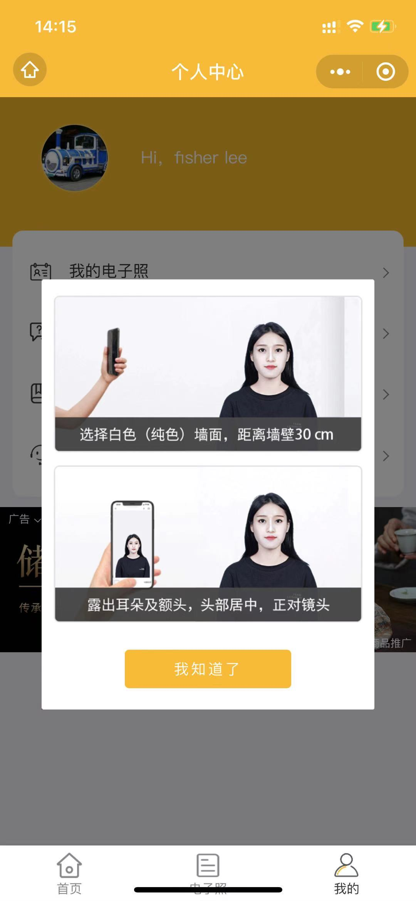

# [AI证件照](https://docs.qq.com/doc/DVlNPZk9TbGJQR0Zp)【微信小程序搜索AI证件照预览版即可体验】

https://user-images.githubusercontent.com/43515350/216925442-8c7f003f-c07b-4c86-8905-a991399f0261.mp4

日常生活和工作学习中有很多需要用到电子证件照的地方，比如教师资格证，身份证，驾驶证，国家司法考试，英语四六级考试，计算机等级考试，高考报名，简历照等等。本项目致力于提供免费、快速、准确的电子证件照生成技术。通过AI深度学习技术一键生成专业的证件照。支持一寸、二寸、小二寸、大二寸、国考等各种规格，还支持自动换底功能，如红色，白色，蓝色等等。

## 基本功能

- 注册登录（实现用户的注册和登录等简单系统功能）
- 智能抠图（采用AI深度学习技术实现人像智能抠图）
- 自动换底（支持多种证件照底色，如红色、蓝色等）
- 上传下载（支持本地上传照片&下载处理后的照片）
- 规格选择（支持各种证件照规格，如一寸、二寸等）
- 后台管理（实现用户和管理员及数据库管理等功能）
- ……

## 扩展功能

- 图像增强（采用传统或AI图像增强算法优化亮度、对比度、饱和度等）
- 一键美颜（采用AI算法实现对人像的美颜功能，但注意不能美颜过度）
- 人脸检测（用户拍摄照片时可采用AI算法实现人脸检测并绘制检测框）
- 节日头像（头像添加圣诞帽——圣诞节 | 国旗的渐变头像——国庆节）
- ……

## 项目说明

## 团队创建

为完成【AI证件照】小程序的项目开发，我们创建了一个4人开发团队。

### 团队成员

- Wenxuan Z：项目经理。
- Xuechao Z：全栈工程师。
- Jiahao T：技术经理。
- Kai L：产品经理。

### 具体分工

- Wenxuan Z：对项目实行质量、安全、进度、成本管理，负责处理所有事务性质的工作。首要职责是在预算范围内按时优质地领导项目小组完成全部项目工作内容，并使客户满意。为此必须在一系列的项目计划、组织和控制活动中做好领导工作，从而实现项目目标。 
- Xuechao Z：熟悉微信小程序前端开发，精通 Python Web 后端开发。负责整个项目的代码实现及线上部署。代码实现包括微信小程序的前端界面，及使用 Python 作为后端开发语言的 Web API 算法服务。兼职项目开发完成后的自动化压力测试和线上部署（腾讯云）。
- Jiahao T：制定并实施项目开发技术发展规划；制定各种技术标准、技术规范；设计、审核各种技术方案和文档； 指导、培训、监督、考核技术队伍，提高技术工作效率；推动重大持续改进项目，组织、沟通协调整个项目相关的人和事。
- Kai L：对项目产品进行规划和管理的。其工作内容包含需求收集，需求分析，需求落地，项目跟踪，项目上线，数据跟踪以及对业务人员进行培训，协助运营、销售、客服等开展工作。此外，还需负责整个项目文档的制作和管理，包括但不限于需求文档，概述文档，接口文档，测试文档等等。

## 代码规范

### 前端

- HTML/CSS: [https://google.github.io/styleguide/htmlcssguide.html](https://google.github.io/styleguide/htmlcssguide.html)
- JavaScript: [https://google.github.io/styleguide/jsguide.html](https://google.github.io/styleguide/jsguide.html)

### 后端

- Python: [https://google.github.io/styleguide/pyguide.html](https://google.github.io/styleguide/pyguide.html)

## 用户故事

| ID | 所属平台   | 所属模块 | 用户故事                                                    | 验收标准                              |
|----|--------|------|---------------------------------------------------------|-----------------------------------|
| 01 | 微信小程序  | 登录注册 | 作为一个<普通用户>，我想要<一键注册和登录>，以便<节省注册登录时间>                    | 用户一打开小程序就弹出微信授权登录界面，点击授权后即可看到首页   |
| 02 | H5管理后台 | 登录注册 | 作为一个<管理人员>，我想要<获取用户部分信息存到数据库中>，以便<对用户进行管理>              | 用户授权登录后部分个人信息会被写入后台数据库            |
| 03 | 微信小程序  | 智能抠图 | 作为一个<普通用户>，我想要<免费、快速、准确的抠图功能>，以便<得到更好的证件照>              | 用户拍摄照片后在1~2秒内即可得到抠图结果             |
| 04 | H5管理后台 | 智能抠图 | 作为一个<管理人员>，我想要<开源、快速、准确的抠图算法服务>，以便<为用户提供更好的服务>          | 管理员实现的抠图算法必须具有一定的吞吐量和并发量          |
| 05 | 微信小程序  | 自动换底 | 作为一个<普通用户>，我想要<选择证件照的底色>，以便<满足各种学习或工作中的需求>              | 用户选择红、蓝、白等底色后，抠图照片即可一键换底          |
| 06 | H5管理后台 | 自动换底 | 作为一个<管理人员>，我想要<提供自动换底算法服务>，以便<用户选择底色后一键换底>              | 管理员提供的换底算法应该快速，让用户感觉不到有延迟         |
| 07 | 微信小程序  | 上传下载 | 作为一个<普通用户>，我想要<从本地上传照片或下载已经制作好的证件照>，以便<保存后用作其它用途>       | 用户可以从本地相册上传照片或拍照上传，可以下载结果证件照      |
| 08 | H5管理后台 | 上传下载 | 作为一个<管理人员>，我想要<提供用户上传或下载接口>，以便<用户操作和使用>                 | 管理员应该分别提供上传和下载API，分别绑定上传和下载按钮     |
| 09 | 微信小程序  | 规格选择 | 作为一个<普通用户>，我想要<各种规格的证件照服务>，以便<满足生活中的不同需求>               | 用户可以选择拍摄一寸、小二寸、二寸等各种尺寸规则的证件照      |
| 10 | H5管理后台 | 规格选择 | 作为一个<管理人员>，我想要<根据常见业务需求提供多种规格证件照服务>，以便<用户在不同生活情景下使用>    | 管理员应该在后台提供各种尺寸规格的证件照接口            |
| 11 | H5管理后台 | 后台管理 | 作为一个<管理人员>，我想要<有一个界面化的后台管理系统>，以便<对小程序产生的数据进行可视化和管理>     | 管理员登录H5后台后可对所有数据进行可视化查看和管理        |
| 12 | 微信小程序  | 图像增强 | 作为一个<普通用户>，我想要<修复因周围环境导致相机成像的不足>，以便<获得更好的成像效果>          | 用户点击图像增强按钮后可修复图像的亮度、对比度、饱和度等参数    |
| 13 | H5管理后台 | 图像增强 | 作为一个<管理人员>，我想要<提供图像增强算法服务供用户选择>，以便<修复因光照不足等原因导致的成像问题>   | 管理员提供的图像增强算法应该在1秒内完成              |
| 14 | 微信小程序  | 一键美颜 | 作为一个<普通用户>，我想要<适当地对自己的照片进行美颜>，以便<给别人更好的第一印象>            | 用户点击一键美颜按钮后可对照片进行适当地美颜            |
| 15 | H5管理后台 | 一键美颜 | 作为一个<管理人员>，我想要<提供简单高效的美颜算法服务>，以便<增强用户体验>                | 管理员提供的美颜算法应该在1秒内完成，且不能美颜过度        |
| 16 | 微信小程序  | 人脸检测 | 作为一个<普通用户>，我想要<在拍照时有一个人脸或上半身虚线框>，以便<在拍照时摆正位置>           | 用户点击拍照时会显示一个人脸检测框和上半身虚线框以辅助用户摆正身体 |
| 17 | H5管理后台 | 人脸检测 | 作为一个<管理人员>，我想要<提供开源高效的人脸检测算法服务>，以便<为用户提供更好的拍照体验>        | 管理员应该提供一个实时的人脸检测算法                |
| 18 | 微信小程序  | 节日头像 | 作为一个<普通用户>，我想要<为我的头像添加节日特效>，以便<在佳节之际有更好的体验>             | 用户圣诞节时可以选择为自己头像添加一个圣诞帽，不同节日添加不同特效 |
| 19 | H5管理后台 | 节日头像 | 作为一个<管理人员>，我想要<在不同的节日为用户提供不同的节日特效算法服务>，以便<为用户提供更好的拍照体验> | 管理员根据节日的不同，提供各种不同的节日特效API         |

*备注：这里默认管理人员就是开发人员。*

## 原型设计

### 邹学超

#### [大师证件照](https://sso.ifanr.com/trochili/miniapp/10100/)

|首页|拍照|付费|效果|更新|
|--|-|-|-|-|
||||||

#### [电子照换底pro](https://sso.ifanr.com/trochili/miniapp/10927/)

|首页|规格|拍照|下载|
|-|-|-|-|
|||||

#### [证件照神器](https://sso.ifanr.com/trochili/miniapp/14120/)

|首页|规格|我的|搜索|攻略|
|--|-|-|-|-|
||||||

### 张文轩

### 唐嘉豪

### 李楷

## 参与贡献

<!-- This project wouldn't exist without our amazing contributors. -->

## 引用参考

> - [https://github.com/google/styleguide](https://github.com/google/styleguide)
